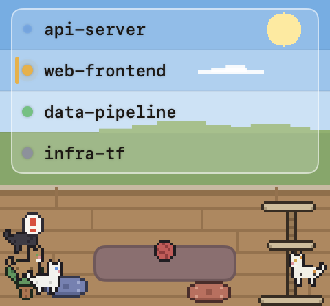
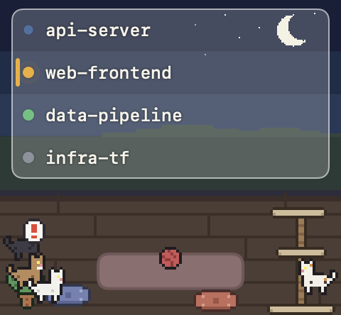

# Agent Manager

複数の Claude Code セッションの状態（🟡確認待ち / 🟢応答完了 / 🔵処理中 / ⚪待機）を、**常時最前面・全 Space 表示の小さなフローティングウィンドウ**で一覧するツール。行をクリックすると該当セッションのターミナル（iTerm2 / Android Studio 等）へジャンプする。

セッション数だけ猫が増える「箱庭（ドット絵の一室）」がそのまま一覧の背景になっており、状態は窓辺のガラスボードに並ぶランプ＋名前で読む。

| 昼 | 夜 |
|----|----|
|  |  |

---

## これは何か

- **セッション一覧が主役**。全面窓ガラスの前に浮かぶ 1 枚のガラスボードに、起動中の Claude Code セッションが「ステータスランプ＋名前」で並ぶ。確認待ち（🟡）の行は左端にアクセントが付き、ランプが脈動して注意を引く。
- **行クリックでターミナルへジャンプ**。iTerm2 なら該当ペインを、Android Studio 等なら該当プロジェクトのウィンドウを前面化する。
- **箱庭は付随情報**。下部の床ストリップにはセッション数ぶんの猫がいて、各セッションの状態に連動して振る舞う（処理中＝活発に歩く / 確認待ち＝前に出て「！」と鳴く / 完了が長引く＝寝床へ / 待機＝寝る）。CPU 占有でメニューバーの猫が走る "RunCat" と同じ発想で、**状態が雰囲気として伝わる**ことを狙ったビュー。猫と個々のセッションの対応は一覧側では明示しない。
- **時刻で昼夜が変わる**。窓の外の景色（空のグラデーション・丘・太陽/月・雲・星）、床、文字色が時刻連動のパレットで一貫して切り替わる。
- **必要なときだけ出る**。確認待ち / 応答完了のセッションが現れると自動で表示、すべて解消すると自動で隠れる。全セッションが終了するとアプリ自体が exit する（次回の `SessionStart` フックで再起動）。Dock には出ず（`.accessory`）、ウィンドウは背景ドラッグで移動できる。

> ビルド成果物 `.build/` は gitignore。

---

## セットアップ手順

```
1. git clone https://github.com/umechanhika/agent-manager.git ~/agent-manager
2. bash ~/agent-manager/scripts/create-signing-cert.sh   # 署名証明書の作成（初回のみ・対話あり）
3. bash ~/agent-manager/scripts/build-app.sh             # 署名済み .app をビルド
4. ~/.claude/settings.json に hooks を登録（下記参照）
5. 新規 Claude Code セッションを開始
     - SessionStart フックで launch.sh が署名済み .app を起動
6. 初回フォーカス時のみ権限付与（「権限・コード署名」を参照）
     - iTerm2: 許可ダイアログで「許可」
     - Android Studio: システム設定 > アクセシビリティ で AgentManager を手動ON
```

**証明書を作らずに `.app` をビルドしようとすると署名IDが無く失敗する**ので、手順 2 を必ず先に通すこと。

### 1. 署名証明書の作成 → ビルド（初回のみ。以降は launcher が必要時に自動ビルド）

```sh
bash ~/agent-manager/scripts/create-signing-cert.sh   # 署名IDを作成（初回のみ・冪等）
bash ~/agent-manager/scripts/build-app.sh             # 署名済み .app を生成
```

`build-app.sh` は安定した名前付き ID（`AgentManager Code Signing`）で署名する。署名IDが無いとビルドは失敗し `~/.claude/agent-manager/build.log` にエラーを残す（詳細は「権限・コード署名」）。

### 2. hooks の登録

`~/.claude/settings.json`（または symlink 元の settings.json）の `hooks` セクションに以下を追加する。

```json
"hooks": {
  "SessionStart": [
    { "hooks": [
      { "type": "command", "command": "$HOME/agent-manager/hooks/agent-manager-hook.sh" },
      { "type": "command", "command": "$HOME/agent-manager/hooks/agent-manager-launch.sh" }
    ]}
  ],
  "UserPromptSubmit": [
    { "hooks": [{ "type": "command", "command": "$HOME/agent-manager/hooks/agent-manager-hook.sh" }]}
  ],
  "PreToolUse":  [{ "matcher": "*", "hooks": [{ "type": "command", "command": "$HOME/agent-manager/hooks/agent-manager-hook.sh" }]}],
  "PostToolUse": [{ "matcher": "*", "hooks": [{ "type": "command", "command": "$HOME/agent-manager/hooks/agent-manager-hook.sh" }]}],
  "Notification": [{ "hooks": [{ "type": "command", "command": "$HOME/agent-manager/hooks/agent-manager-hook.sh" }]}],
  "Stop":        [{ "hooks": [{ "type": "command", "command": "$HOME/agent-manager/hooks/agent-manager-hook.sh" }]}],
  "SessionEnd":  [{ "hooks": [{ "type": "command", "command": "$HOME/agent-manager/hooks/agent-manager-hook.sh" }]}]
}
```

各 hook イベントが `agent-manager-hook.sh`（状態書き込み）を、`SessionStart` は加えて `agent-manager-launch.sh`（アプリ起動）を呼ぶ。

依存: `python3`（macOS 標準の `/usr/bin/python3` でOK）。`jq` は不要。

### 3. 起動

新規 Claude Code セッションを開始すると `agent-manager-launch.sh` が自動で起動する。ソースが成果物より新しければ（pull 直後など）起動前に自動でリビルドされる。手動起動する場合:

```sh
~/agent-manager/hooks/agent-manager-launch.sh      # 未起動 or 古ければ build して起動（冪等）
# または直接 .app を:
/usr/bin/open ~/agent-manager/.build/AgentManager.app
```

#### pull した新コードを即時反映したいとき

新コードを pull した時点でアプリが起動中だと、その古いプロセスはそのまま動き続ける（自動リビルドは新規起動時のみ）。すぐ差し替えたい場合は、起動中プロセスを終了してから作り直す:

```sh
pkill -f "AgentManager.app/Contents/MacOS/AgentManager"   # 起動中の古いアプリを終了
bash ~/agent-manager/scripts/build-app.sh         # 最新ソースから .app を作り直す
/usr/bin/open -g ~/agent-manager/.build/AgentManager.app   # 起動
```

---

## 仕組み

### データの流れ

```
Claude Code の各セッション
   │ hooks
   ├─ SessionStart: agent-manager-launch.sh（未起動 or ソースが新しければ build & 起動）
   ▼
hooks/agent-manager-hook.sh ──▶ ~/.claude/agent-manager/sessions/<session_id>.json
                                       │ FSEvents で監視
                                       ▼
                                AgentManager（フローティング窓）
                                       │ クリック → ホスト別フォーカス
                                       ▼
                    iTerm2: 該当ペインを選択 / Android Studio等: 該当ウィンドウを前面化
```

- hook と Swift アプリは**ファイル経由でのみ連携する疎結合構成**。状態ファイル（`~/.claude/agent-manager/sessions/`）はマシンローカル（リポジトリには含めない）。
- 状態検知は Claude Code の hooks。マッピングは `hooks/agent-manager-hook.sh` の `STATE_BY_EVENT` で調整可能（例: `Stop` を `waiting` にすると応答完了を「確認待ち」扱いにできる）。
- アプリの起動は `SessionStart` フックの `agent-manager-launch.sh` が担う。未起動なら（必要に応じて release ビルドして）起動し、起動済みなら何もしない。セッション開始を遅延させないよう重い処理はバックグラウンドに逃がす。
- **pull した新コードの自動反映**: `.build/` は gitignore のため `git pull` ではソースだけ更新され、成果物 `.app` は古いまま残る。`agent-manager-launch.sh` は新規起動時（プロセス未起動時）に **ビルド入力（`Sources/` / `Package.swift` / `scripts/`）が成果物より新しいかを mtime で判定し、新しければ自動でリビルド**してから起動する。起動中の古いプロセスには触らない（全セッション終了で自動 exit するので、次の新規起動で新コードに切り替わる）。

### 状態の対応

| 表示 | 色 | state | 発火 hook | 意味 |
|------|----|-------|-----------|------|
| 確認待ち | 🟡 黄 | `waiting` | `Notification`（`permission_prompt`） | ツール許可 / プラン承認 / 選択肢回答など、**ユーザーの確認・操作が必要でブロック中** |
| 応答完了 | 🟢 緑 | `done` | `Stop` / `Notification`（`idle_prompt`） | Claudeのターンが終わり、**次の指示待ち**（完了後に放置されても緑のまま） |
| 処理中 | 🔵 青 | `processing` | `UserPromptSubmit` / `PreToolUse` / `PostToolUse` | 稼働中 |
| 待機 | ⚪ 灰 | `idle` | `SessionStart` | 開始直後でまだ何もしていない |

`Notification` は `notification_type` で扱いを分ける。`permission_prompt`（許可・プラン承認・選択肢回答の待ち）は確認待ち、`idle_prompt`（完了後の放置によるアイドル）は応答完了を維持する。`ExitPlanMode` / `AskUserQuestion` は `PreToolUse`（処理中）の後に `permission_prompt` が来るため、自然に確認待ちへ遷移する。

- 並び順は固定（`created_at` 順）。
- セッション終了（`SessionEnd`）で一覧から消える。
- 確認待ち / 応答完了のセッションが現れるとウィンドウを自動表示、すべて解消すると自動で隠れる。全セッション終了でアプリは exit。
- 30 分以上更新の無いエントリは薄く表示（hook 取りこぼし時の名残対策）。

### クリックでジャンプ（ホスト別フォーカス）

クリックされたセッションの `host_bundle_id` に応じて挙動を変える。

| ホスト | 挙動 | 必要な権限 |
|--------|------|-----------|
| iTerm2 (`com.googlecode.iterm2`) | `ITERM_SESSION_ID` の GUID で該当ペインを AppleScript 選択＋前面化 | Automation（iTerm2 制御） |
| その他 (Android Studio `com.google.android.studio` 等) | System Events で全ウィンドウタイトルを列挙し、**該当プロジェクトのウィンドウを一意に特定できたときだけ** AXRaise（特定不能なら誤前面化しない） | Automation（System Events）＋ アクセシビリティ |

各セッションのホストアプリは hook が**プロセスツリーを遡って、ターミナルを内包する最も近い `.app` の bundle id**を解決して判定する。`__CFBundleIdentifier` / `ITERM_SESSION_ID` は当てにしない（Android Studio を iTerm2 から `studio .` で起動すると、AS の統合ターミナル子プロセスがこれらに iTerm2 の値を継承してしまい誤判定するため）。`iterm_session_id` は host が iTerm2 と確定したときだけ記録する。

#### ウィンドウ特定ロジック（同一チケットの別ブランチ対策）

ワークツリーは同一チケットの別ブランチでプロジェクト名が前方一致しやすく、単純な部分一致（title contains）だと別ウィンドウへ誤って飛ぶ。これを避けるため `ITermFocus.swift` は次の順で**厳密に1件だけ**特定する（一意に決まらなければ前面化を見送る）:

1. **フルパス優先**: タイトルに `cwd`（一意なワークツリー絶対パス）を含むウィンドウが1件あれば採用。Android Studio の `Settings > Appearance & Behavior > Appearance > Show full path in window header` を ON にすると、この最も確実な方法でマッチする（推奨）。
2. **境界考慮のプロジェクト名一致**: フルパスで決まらなければ、タイトルが `label`（ワークツリー名）で始まり、直後が境界文字（空白・en-dash `–` 等。ASCII ハイフン `-` は branch 名の一部なので**境界に含めない**）のウィンドウだけを候補にする。これで `feature-MBDEV-82` が `feature-MBDEV-82-...` に誤マッチしない。
3. 上記で候補が 0 件 / 複数のときは AXRaise せず、`focus.log` に理由を残す（勝手に新規プロジェクトを開かない）。

フォーカスの成否は `~/.claude/agent-manager/focus.log` に記録（マッチ方式 `via=fullpath`/`via=label`・採用 `title`・`raised` / `no unique window match` / `status`/`err`）。

### 箱庭ビューの仕組み

- **共有された一室**。窓・床・文字色は単一の時刻連動パレット（`SkyTheme`）から色を取り、昼/夕/夜が地続きに切り替わる（環境変数 `AGENT_MANAGER_HOUR` で時刻を上書きして確認可能）。
- **背景＝行に合わせたフラットバンド**。窓の外の景色は各セッション行のサイズに合わせた均一色の帯として描かれ、行の区切り線が無くても自然に区切って見える。太陽/月・雲・星は左寄せの文字に被らないよう右側へ寄せている。
- **一覧＝1 枚の半透明ガラスボード**。区切り線なしで全セッションを載せ、背後の景色が透ける。各行はステータスランプ＋名前のみ（状態文言・経過時間は出さない）。確認待ちの行だけ左端にアクセントストライプ。
- **ステータスランプ**はメニューバーと同じ `Session.color`。確認待ち＝広がって消えるハロー（脈動）、処理中＝穏やかな呼吸、完了/待機＝静止。
- **床の猫**はセッション数だけ存在し、状態で行動が変わる（RunCat 風）。色はセッション ID から決定論的に割り当て。
- **CPU 配慮**。8Hz で再描画するのは床の猫キャンバスだけ。一覧は状態ストアのみ、窓の背景は時刻のみに依存させ 8Hz の再描画に巻き込まない。ウィンドウが非表示・最小化・完全被覆になると tick を止め、実質 ~0% に落ちる。

---

## 権限・コード署名

iTerm2 や System Events を制御するには macOS の権限が必要。このため本アプリは**`.app` バンドル**（`scripts/build-app.sh` が `.build/AgentManager.app` を生成、安定したバンドルID＋名前付きコード署名）として `open` 起動する（TCC が許可を安定記憶できるように）。

- **iTerm2 セッション**: 初回クリックで「"AgentManager" が "iTerm2" を制御…」を **許可**。
- **Android Studio 等**: ウィンドウの列挙・選択に **アクセシビリティ権限** が必要。`システム設定 > プライバシーとセキュリティ > アクセシビリティ` で **AgentManager を ON**。未許可だとウィンドウを列挙できないため前面化は行われず、`focus.log` に権限付与を促すメッセージを残す。

### コード署名証明書の作成（初回のみ・推奨）

ad-hoc 署名（`codesign --sign -`）は cdhash ベースの署名要件になるため、`.app` をリビルドするたびに macOS が「別アプリ」とみなし、付与済みのアクセシビリティ／Automation 権限が無効化される。これを防ぐため、安定した自己署名のコード署名証明書を 1 つ作っておく（`build-app.sh` が `AgentManager Code Signing` という名前の ID で署名する）。

```sh
bash scripts/create-signing-cert.sh
```

**通常のターミナル（Terminal.app / iTerm2）で実行すること**（Claude セッションの `!` 実行は対話入力ができないため不可）。このスクリプトは openssl で自己署名のコード署名証明書を生成して login キーチェーンへ取り込み、コード署名用に信頼設定する（冪等：既に有効な ID があれば何もしない。過去の失敗で残った重複証明書も掃除する）。途中で次の認証が出る:

- **信頼設定の追加**: macOS の認証ダイアログ（Touch ID / ログインパスワード）。
- **鍵アクセス許可**: login キーチェーンのパスワードを尋ねる。空 Enter でスキップ可（その場合は初回 `codesign` 時に GUI で「常に許可」を押す）。`KEYCHAIN_PASSWORD=xxx` を付けて実行すれば対話入力なしで設定できる。

- 作成後 `bash scripts/build-app.sh` がこの ID で署名する。
- 署名 ID を切り替えた直後は一度だけアクセシビリティ権限の再付与が必要（`システム設定 > アクセシビリティ` で AgentManager を一旦削除して再追加）。
- GUI で作りたい場合は キーチェーンアクセス > `証明書アシスタント > 証明書を作成…` で 名前=`AgentManager Code Signing`・証明書のタイプ=`コード署名` を選んでも同じ。

> **ad-hoc 署名へのフォールバックはしない。** 黙って ad-hoc に落ちると「リビルドで権限が消える」問題に気付けないため、署名IDが無ければビルドは**失敗**し、`~/.claude/agent-manager/build.log` にエラーを残す。ランチャー経由（`launch.sh`）の自動ビルドで失敗したときは、この `build.log` を見れば原因が分かる。

---

## ファイル構成

```
hooks/agent-manager-hook.sh     状態ファイルの upsert（python3 利用、全hookから呼ばれる）
hooks/agent-manager-launch.sh   SessionStart用: 未起動なら .app をbuild & open起動（冪等）
scripts/build-app.sh            release build → 最小 .app バンドル生成（Info.plist+名前付き署名。IDが無ければ失敗）
scripts/create-signing-cert.sh  署名用の自己署名コード署名証明書を作成（初回のみ・冪等）
scripts/make-icon.swift         アプリアイコン生成
Package.swift
Sources/AgentManager/
  main.swift                    NSApplication / フローティング NSPanel（中身追従の高さ・上端固定）
  ContentView.swift             セッション一覧 UI（ガラスボード＋ステータスランプ・SwiftUI）
  SessionStore.swift            sessions/ の FSEvents 監視 + JSON 読込
  StatusBarController.swift      メニューバー常駐（状態別件数・表示トグル・waiting/done 連動の自動表示）
  ITermFocus.swift              クリック → ホスト別フォーカス（iTerm2ペイン / 他アプリのウィンドウ）+ focus.log
  Cat/SandboxView.swift          箱庭ビュー（全面窓ガラス背景・床ストリップ・昼夜パレット SkyTheme）
  Cat/CatSimulation.swift        猫の行動シミュレーション（状態連動・8Hz tick・非表示時は停止）
  Pixel/SpriteRenderer.swift     ドット絵スプライトの描画（パレット・速度をセッションIDから決定論的に）
  Pixel/SpriteData.swift         猫・家具などスプライトのドットデータ
  Sound/MeowPlayer.swift         確認待ちエッジでの鳴き声再生
docs/images/                    README 用スクリーンショット
.build/                         ビルド成果物・AgentManager.app（gitignore）
```

---

## 将来の拡張

- **ログイン項目での常駐**: 現状は `SessionStart` ランチャーが起動を担保。`.build/AgentManager.app` をログイン項目に追加すれば Claude Code 起動前から常駐させられる。
